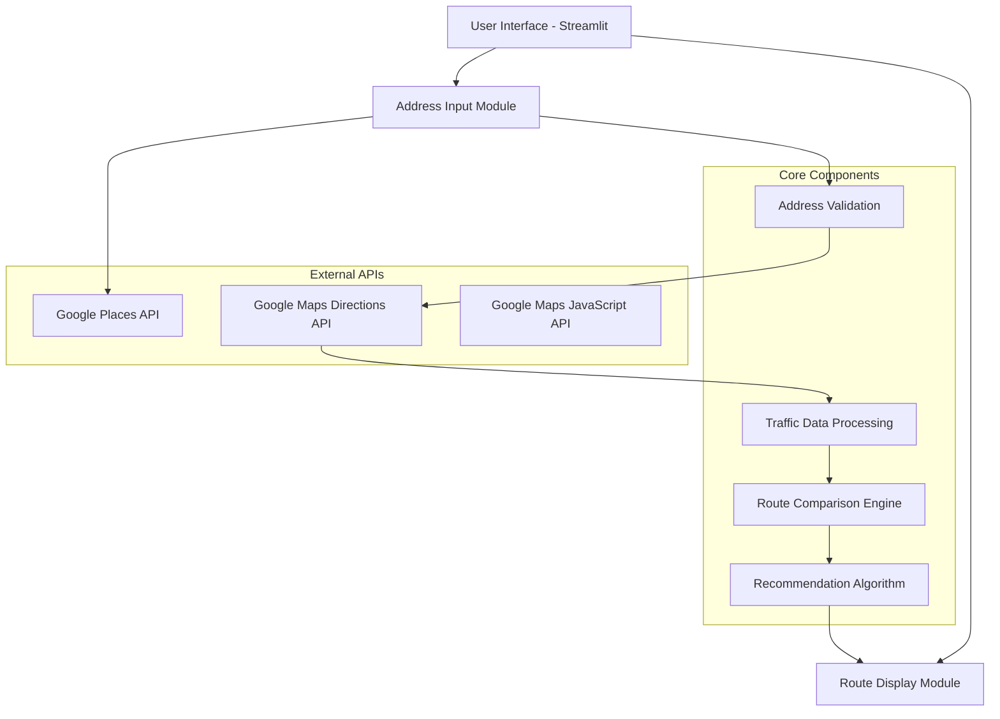

# NYC Traffic-Aware Route Recommendation System
## Technical Architecture Plan

### Project Overview
A Streamlit web application that provides real-time traffic analysis and route recommendations for New York City using Google Maps APIs.

### System Architecture



### Technology Stack

#### Backend
- **Python 3.8+**: Core programming language
- **Streamlit**: Web application framework
- **googlemaps**: Python client for Google Maps APIs
- **requests**: HTTP library for API calls
- **pandas**: Data manipulation and analysis
- **numpy**: Numerical computations

#### Frontend
- **Streamlit Components**: Native UI elements
- **streamlit-folium**: Interactive map integration
- **HTML/CSS**: Custom styling
- **JavaScript**: Map interactions (via Streamlit components)

#### APIs & Services
- **Google Places API**: Address autocomplete and validation
- **Google Maps Directions API**: Route calculation with traffic
- **Google Maps JavaScript API**: Interactive map display

### Core Features

#### 1. Address Input System
- **Autocomplete**: Real-time address suggestions using Google Places API
- **Validation**: Verify addresses exist and are within NYC boundaries
- **Geocoding**: Convert addresses to latitude/longitude coordinates

#### 2. Route Calculation Engine
- **Multiple Routes**: Calculate 3-5 alternative routes
- **Traffic Integration**: Real-time traffic data consideration
- **Time Estimation**: Accurate travel time predictions
- **Distance Calculation**: Route distance metrics

#### 3. Recommendation Algorithm
- **Traffic Weight**: Prioritize routes with less congestion
- **Time Optimization**: Fastest route identification
- **Distance Factor**: Balance between time and distance
- **Historical Data**: Consider typical traffic patterns

#### 4. User Interface Components
- **Input Form**: Start/end address fields with autocomplete
- **Route Display**: Interactive map with route overlays
- **Comparison Table**: Side-by-side route analysis
- **Real-time Updates**: Live traffic status updates

### File Structure
```
nyc_route_optimizer/
├── app.py                 # Main Streamlit application
├── config/
│   ├── __init__.py
│   ├── settings.py        # Configuration management
│   └── api_keys.py        # API credentials (gitignored)
├── src/
│   ├── __init__.py
│   ├── maps/
│   │   ├── __init__.py
│   │   ├── places_api.py  # Google Places integration
│   │   ├── directions.py  # Route calculation
│   │   └── traffic.py     # Traffic data processing
│   ├── ui/
│   │   ├── __init__.py
│   │   ├── components.py  # Reusable UI components
│   │   └── map_display.py # Map visualization
│   └── utils/
│       ├── __init__.py
│       ├── validation.py  # Address validation
│       └── helpers.py     # Utility functions
├── requirements.txt       # Python dependencies
├── .env.example          # Environment variables template
├── .gitignore           # Git ignore rules
└── README.md            # Project documentation
```

### API Requirements

#### Google Cloud Platform Setup
1. **Required APIs**:
   - Google Maps JavaScript API
   - Google Places API (New)
   - Google Maps Directions API
   - Google Maps Geocoding API

2. **Billing**: Required for production usage
3. **API Limits**: Monitor usage to stay within quotas
4. **Security**: Implement API key restrictions

### Data Flow

#### Route Request Process
1. User enters start/end addresses
2. Address autocomplete suggests valid locations
3. System validates addresses are in NYC
4. Geocoding converts addresses to coordinates
5. Directions API calculates multiple routes
6. Traffic data enhances route analysis
7. Algorithm ranks routes by efficiency
8. Results displayed on interactive map

#### Real-time Updates
- Traffic conditions refresh every 5 minutes
- Route recalculation on significant traffic changes
- User notifications for better route availability

### Performance Considerations

#### Optimization Strategies
- **Caching**: Store frequent route calculations
- **Batch Processing**: Group API calls efficiently
- **Rate Limiting**: Respect API quotas
- **Error Handling**: Graceful degradation on API failures

#### Scalability
- **Session State**: Maintain user data across interactions
- **Memory Management**: Efficient data structure usage
- **API Efficiency**: Minimize unnecessary API calls

### Security & Configuration

#### Environment Variables
```bash
GOOGLE_MAPS_API_KEY=your_api_key_here
GOOGLE_PLACES_API_KEY=your_places_key_here
NYC_BOUNDS_NORTH=40.9176
NYC_BOUNDS_SOUTH=40.4774
NYC_BOUNDS_EAST=-73.7004
NYC_BOUNDS_WEST=-74.2591
```

#### API Key Security
- Environment-based configuration
- Git ignore for sensitive files
- API key restrictions by domain/IP
- Regular key rotation

### Testing Strategy

#### Test Cases
- Valid NYC addresses
- Invalid/out-of-bounds addresses
- Network connectivity issues
- API rate limit scenarios
- Traffic data accuracy

#### Quality Assurance
- Cross-browser compatibility
- Mobile responsiveness
- Performance benchmarking
- User experience testing

### Deployment Options

#### Local Development
- Python virtual environment
- Streamlit development server
- Local testing with sample data

#### Production Deployment
- **Streamlit Cloud**: Simple deployment option
- **Heroku**: Scalable cloud platform
- **AWS/GCP**: Enterprise-grade hosting
- **Docker**: Containerized deployment

### Future Enhancements

#### Potential Features
- Historical traffic pattern analysis
- Route preferences (avoid tolls, highways)
- Multi-stop route optimization
- Public transit integration
- Weather impact consideration
- User route history and favorites

This architecture provides a solid foundation for building a robust, scalable traffic-aware route recommendation system for New York City.